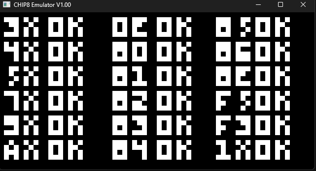
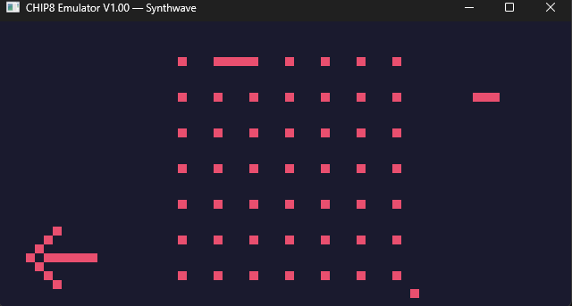
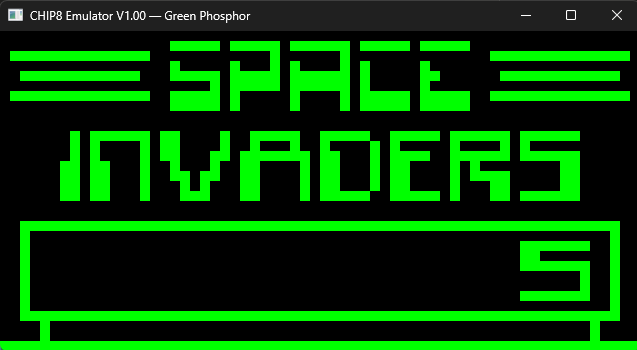

# A rust based chip-8 emulator

An intro to emulation using rust

## Features

- Full Chip8 Instruction set with 34 opcodes implemented.
- 6 Themes implemented
- Audio support 

## Screenshots





## Running

```powershell
chip8.exe roms\your_rom.ch8
```


## Controls

| Key | CHIP-8 |
|-----|--------|
| 1 2 3 4 | 1 2 3 C |
| Q W E R | 4 5 6 D |
| A S D F | 7 8 9 E |
| Z X C V | A 0 B F |

| Key | Action |
|-----|--------|
| T | Cycle theme |
| Escape | Quit |

## Requirements

- Windows 10/11
- No additional dependencies required

## Sources -

- CHIP-8 design : https://tobiasvl.github.io/blog/write-a-chip-8-emulator/#prerequisites
- Test Rom : https://github.com/corax89/chip8-test-rom/tree/master
